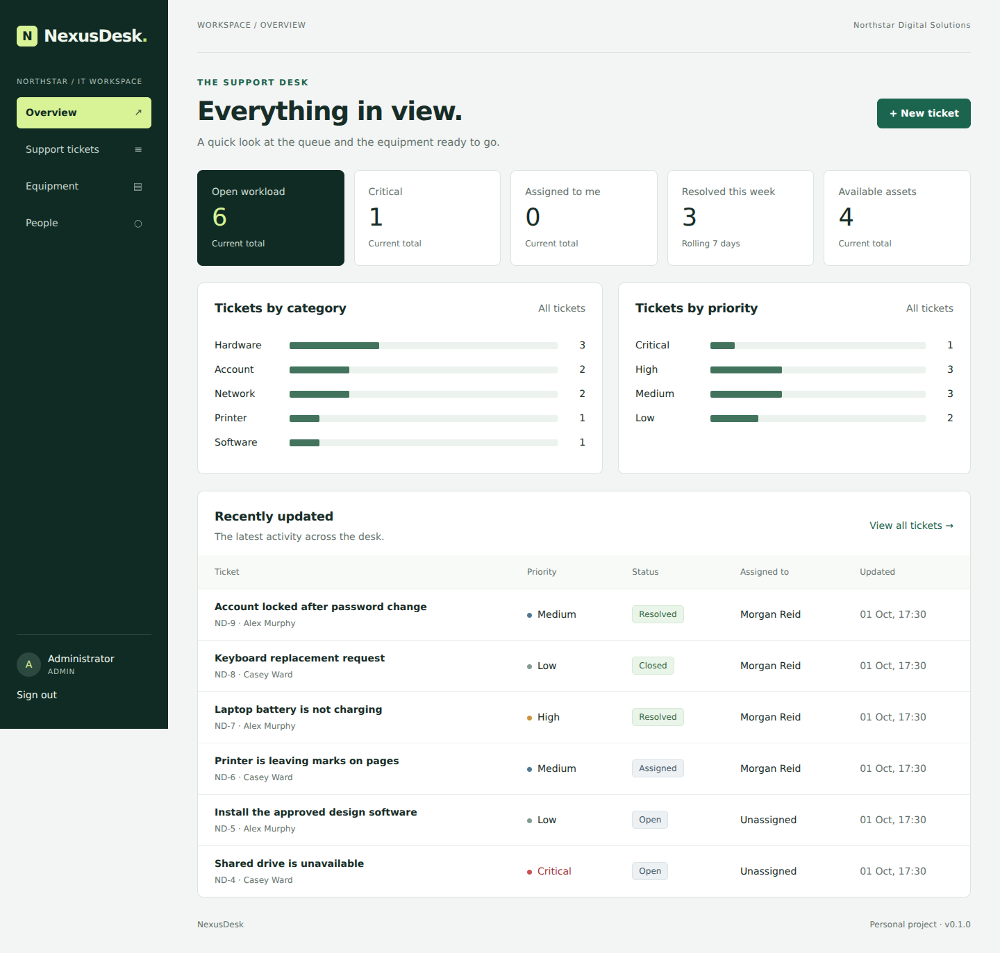
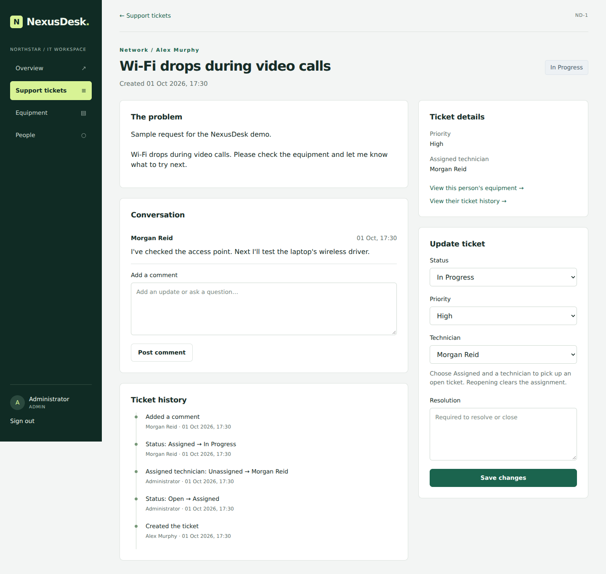
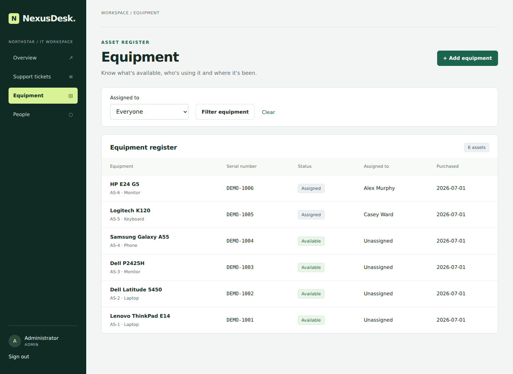

# NexusDesk

I wanted a project where Java and SQL do something useful. NexusDesk is a small IT helpdesk: employees can report a problem, IT staff can work through it, and an administrator can keep track of company equipment and accounts.

I wrote the brief myself as practice, for a fictional company called Northstar Digital Solutions. It isn't a real client, it isn't coursework, and it isn't something I've delivered for anyone.

**How it was built:** I set the brief and asked Codex to build the first version in Java, Spring Boot and SQL. Codex wrote nearly all of the code, the tests and these docs. It also ran the tests, took the screenshots and opened the two issues and the pull request, over two sessions on 1 and 2 October 2026. It split each session's work into commits at the end, which is why seven of them were made within ten seconds of each other. The history shows the order the work was done in, not me committing as I went. I haven't changed the code myself yet. I'm working through it now (see the [learning notes](docs/learning-notes.md)), and from here each pull request will say how much of the change is mine.



## What works

- Create, assign, prioritise, resolve, close and reopen support tickets.
- Add comments and follow a ticket's history, including old resolution notes after reopening.
- Search ticket titles and filter by status, priority, category, employee, technician or date.
- Register equipment, assign it, return it and see previous assignments.
- Create, edit and disable accounts as an administrator.
- See workload totals, available equipment and category/priority charts as IT staff.
- Data stays in a relational database file between restarts.

| Account | Access |
| --- | --- |
| Employee | Create tickets, see and comment on their own tickets, and see their assigned equipment. |
| Technician | Work on all tickets, view people's ticket and equipment history, and use the dashboard. |
| Administrator | Technician access plus account and equipment management. |

## Run the demo

You need **JDK 17 or 21**. The Maven wrapper is included, so a separate Maven installation isn't needed. The first build needs internet access to download dependencies.

```bash
git clone https://github.com/JamieP-205/NexusDesk.git
cd NexusDesk
./mvnw spring-boot:run -Dspring-boot.run.profiles=demo
```

In Windows PowerShell:

```powershell
git clone https://github.com/JamieP-205/NexusDesk.git
cd NexusDesk
.\mvnw.cmd spring-boot:run "-Dspring-boot.run.profiles=demo"
```

Then open **http://localhost:8080**. The demo uses fictional records and a separate file at `data/nexusdesk-demo.mv.db`.

| Role | Email | Demo password |
| --- | --- | --- |
| Administrator | `admin@example.test` | `Demo-password-123` |
| Technician | `tech@example.test` | `Demo-password-123` |
| Employee | `employee@example.test` | `Demo-password-123` |

These credentials are public and only for the local demo. Use the normal profile for anything else.

## Start with an empty database

In PowerShell:

```powershell
$env:NEXUSDESK_ADMIN_EMAIL = "jamie@example.test"
$env:NEXUSDESK_ADMIN_PASSWORD = Read-Host "Choose an admin password (12-128 characters)" -MaskInput
.\mvnw.cmd spring-boot:run
```

`-MaskInput` needs PowerShell 7. In Windows PowerShell 5.1, set the variable in your IDE run configuration, or use this secure prompt conversion:

```powershell
$secret = Read-Host "Choose an admin password" -AsSecureString
$env:NEXUSDESK_ADMIN_PASSWORD = [System.Net.NetworkCredential]::new("", $secret).Password
.\mvnw.cmd spring-boot:run
```

On macOS/Linux (Bash):

```bash
export NEXUSDESK_ADMIN_EMAIL='jamie@example.test'
read -rsp 'Choose an admin password: ' NEXUSDESK_ADMIN_PASSWORD
export NEXUSDESK_ADMIN_PASSWORD
./mvnw spring-boot:run
```

The first startup creates one administrator if there are no users. Setting these variables later does **not** reset an existing account. You can remove the password variable after the first successful start.

The normal database is `data/nexusdesk.mv.db`. Flyway applies the SQL migrations automatically, so there's no need to create tables by hand. `.env.example` describes the optional settings; it is a reference file, not automatically loaded configuration.

Stop the server before backing up the database file, and keep backups private. Deleting the database resets the app and loses its data, so it isn't a normal upgrade step.

## Build and test

```bash
./mvnw verify
# Optional full HTTP flow and restart check (Python 3.10+):
python scripts/smoke_test.py
java -jar target/nexusdesk-0.1.0.jar --spring.profiles.active=demo
```

On Windows, replace `./mvnw` with `.\mvnw.cmd`. CI checks Java 17 and 21. The tests use separate in-memory databases and never touch the normal or demo files.

## Stack and structure

Java 17, Spring Boot 3.5.16, Spring MVC, Spring Security, Thymeleaf, Spring JDBC, H2, Flyway, JUnit 5 and plain CSS. There is no frontend build, paid service or AI API key needed to run the app.

- `src/main/java/dev/jamie/nexusdesk/model/` holds the data records.
- `service/` holds business rules, parameterised SQL and transaction boundaries.
- `web/` handles routes and page models; `config/` handles login and startup.
- `src/main/resources/db/migration/` holds the versioned schema.
- `templates/` and `static/` hold the interface.
- `src/test/` holds integration and security tests.
- `docs/` holds the plan, backlog, diagrams, testing notes and screenshots.

The SQL lives in the services for now. If those classes get hard to follow, moving it into repository classes is the obvious next refactor.

[Design and ER diagram](docs/design.md) · [Requirements](docs/requirements.md) · [Backlog](docs/backlog.md) · [Build log](docs/dev-journal.md) · [Testing](docs/testing.md) · [Commit history](docs/commit-history.md)

## A closer look



The problem and the discussion sit beside the ticket controls. The server checks status changes and detects stale edits.



Current ownership is kept separate from the assignment history, so returning an asset doesn't remove who used it before.

[Sign-in screenshot](docs/screenshots/login.png) · [Mobile screenshot](docs/screenshots/mobile.png) · [Wireframes](docs/wireframes.svg)

## What I still need to learn

I'm leaving my personal reflection open until I've run and changed the app myself. I don't want to claim understanding just because the generated tests pass. The concrete things I need to be able to explain are:

- Why a ticket update and its history belong in one transaction.
- Why hiding an admin button doesn't protect its URL.
- How a unique constraint prevents two current owners of an asset.
- Why H2's generated timestamps broke the original ID lookup, and how requesting only the ID fixed it.
- What each `SELECT ... FOR UPDATE` in the services is protecting against.

I've included a [code walkthrough](docs/learning-notes.md) so I can work through those points and make my own follow-up changes.

## Limits and next steps

A review on 2 October found two problems I haven't fixed yet, and I plan to fix both myself as my first changes:

- Passwords are hashed with PBKDF2-HMAC-SHA1, not SHA-256 as these docs first said. The constructor in `SecurityConfig` is Spring's deprecated one, which defaults to SHA-1. [Security notes](SECURITY.md) have the detail.
- Choosing a technician while leaving a ticket Open silently drops the assignment, and the page still says "Ticket updated".

I haven't implemented attachments, email, password reset, CSV/PDF export, SLA timers or similar-ticket suggestions. These are tracked as future work, not working features. Tickets are not paginated yet. Error pages keep database details private, but form errors could be more helpful beside the relevant field.

The file-backed H2 setup is for one local app instance. It isn't a production deployment. I would need HTTPS, login throttling, backups and a deployment/database review before using real staff data.

## Licence

I've released the project under the [MIT licence](LICENSE).
