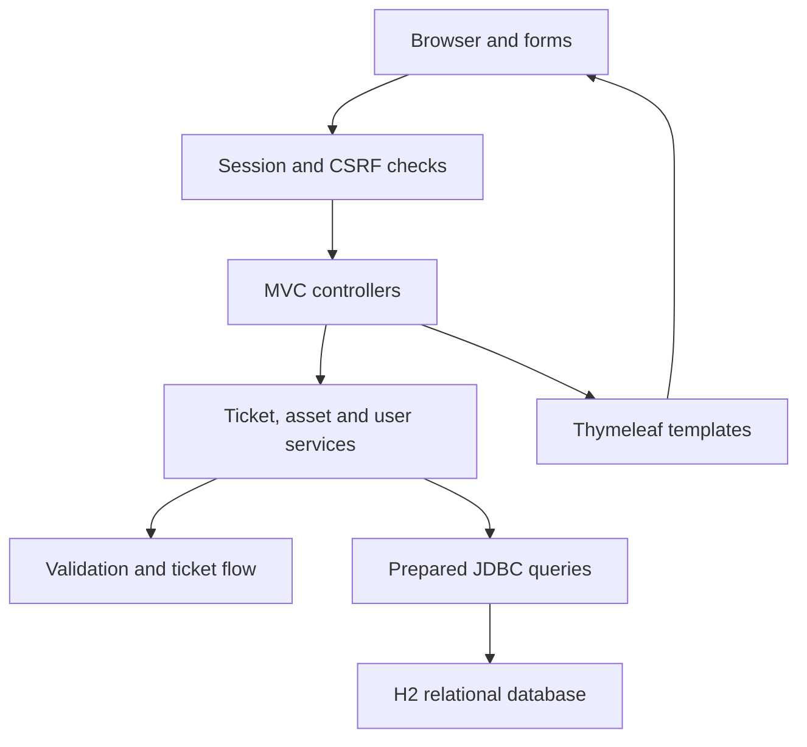
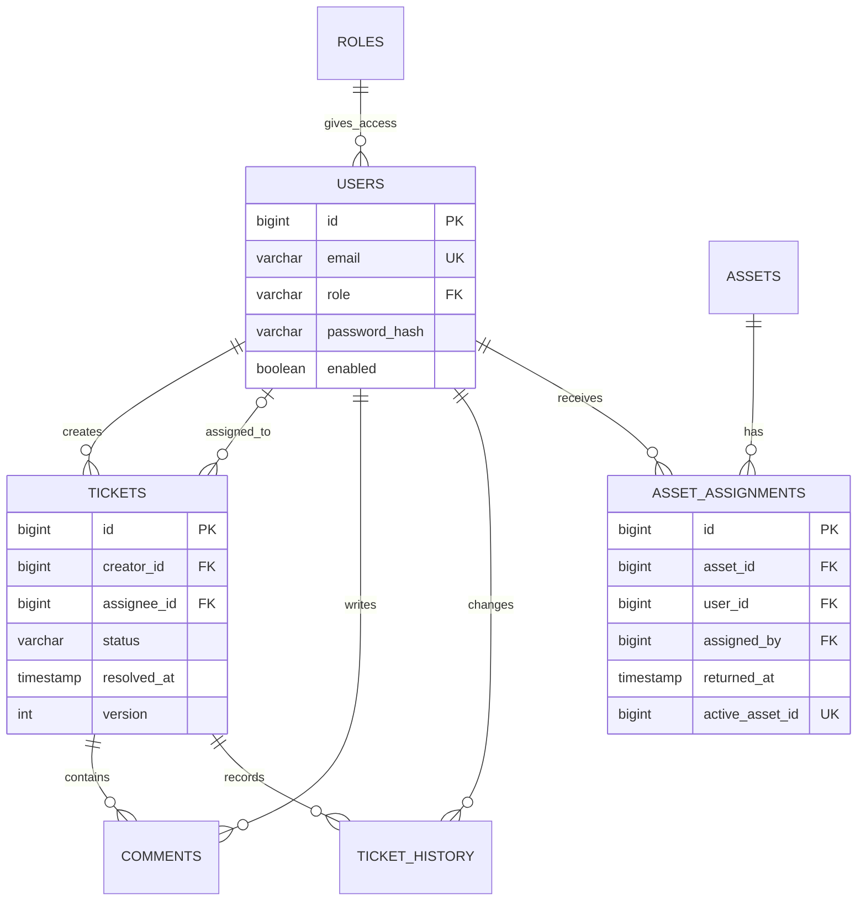
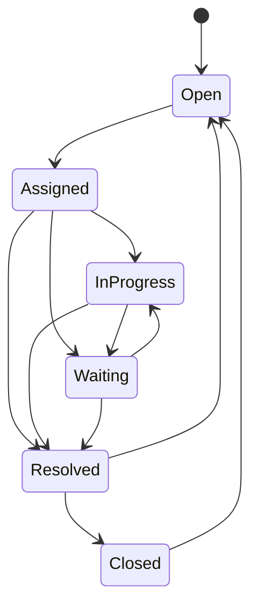
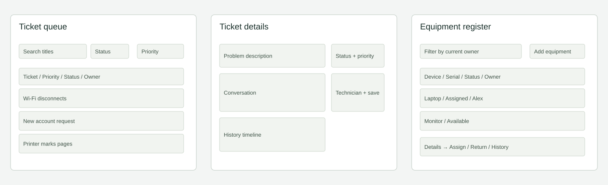

# How I’ve structured it

I kept the application as a single Java server. The browser sends ordinary form requests. Controllers turn those requests into service calls; services apply the rules and use JDBC inside transactions where needed.

I use records for rows that pages read. I keep constructors explicit and let Spring supply the dependencies. I haven't used inheritance for Employee/Technician/Admin because roles change and they aren't different kinds of stored person.

## Database relationships

I don't repeat user names or email addresses in each ticket. I join them when reading. History stores the event text as it happened; resolution details get a separate field. I don't offer history deletion through the app.

`asset_assignments.active_asset_id` is a generated column. It contains the asset ID for current assignments and null for returned ones. Its unique constraint allows many old assignments but only one current one. The service also locks the asset row while assigning or returning it.

I use version numbers for stale ticket/equipment forms. A save with an old version returns a conflict instead of silently overwriting someone else's work.

## Ticket flow

I need an active assignee for any state after Open, plus resolution text for Resolved and Closed. Reopening clears the current assignment, but earlier events and fixes stay in the history.

## Navigation and wireframes

I send employees straight to their tickets after login. IT staff start at the overview. Both can reach tickets and equipment from the navigation; administrators also get People.

I kept the queue and equipment as tables because the information needs comparing across rows. I put conversation and history on the ticket page with the update controls alongside them on desktop and below them on a narrow screen. The implemented pages are shown in the README screenshots.
